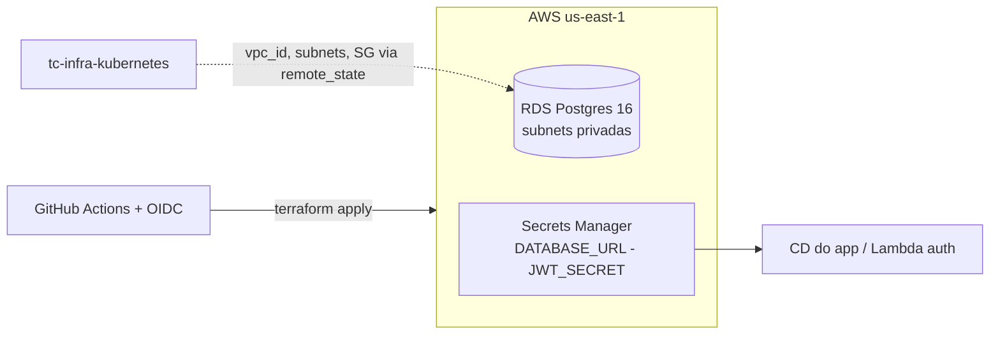

# tc-infra-database

Infraestrutura do banco gerenciado do Tech Challenge (Fase 3 — FIAP):
**RDS PostgreSQL 16** (`db.t3.micro`, subnets privadas, criptografado, acesso 5432 restrito
ao SG dos nodes do EKS) e **Secrets Manager** (`DATABASE_URL`, `JWT_SECRET`). Senhas geradas
pelo Terraform (`random_password`) — nenhum segredo manual na esteira.

## Arquitetura

## Esteira (CI/CD)

| Evento | Ação |
| --- | --- |
| Pull Request | `fmt` + `validate` + `plan` |
| Merge na `main` | `apply` automático |
| Botão Actions (workflow_dispatch) | `plan` \| `apply` \| `destroy` |

Autenticação via **OIDC** (role `gha-tc-infra-database`) — nenhum secret de AWS no repo.

## Subir / derrubar

- **Pré-requisito para subir:** `tc-infra-kubernetes` aplicado (este repo lê a VPC dele via `terraform_remote_state`).
- **Subir:** merge na `main` ou Actions → `apply` (~10 min).
- **Derrubar:** Actions → `destroy` — **sempre antes** de derrubar o `tc-infra-kubernetes`.

## Justificativa do banco

PostgreSQL por transações ACID multi-entidade (fechamento de OS), integridade referencial
das invariantes do domínio, `DECIMAL` para valores monetários e enums nativos para o ciclo
de vida da OS — justificativa completa no [README do app](https://github.com/Os-Desacoplados-Pos-Tech-SOAP-FIAP/tech_challange_1#justificativa-t%C3%A9cnica--postgresql).

## Repositórios relacionados

- [tech_challange_1](https://github.com/Os-Desacoplados-Pos-Tech-SOAP-FIAP/tech_challange_1) — aplicação NestJS
- [tc-infra-kubernetes](https://github.com/Os-Desacoplados-Pos-Tech-SOAP-FIAP/tc-infra-kubernetes) — VPC, EKS, ECR
- [tc-lambda-auth](https://github.com/Os-Desacoplados-Pos-Tech-SOAP-FIAP/tc-lambda-auth) — autenticação por CPF
